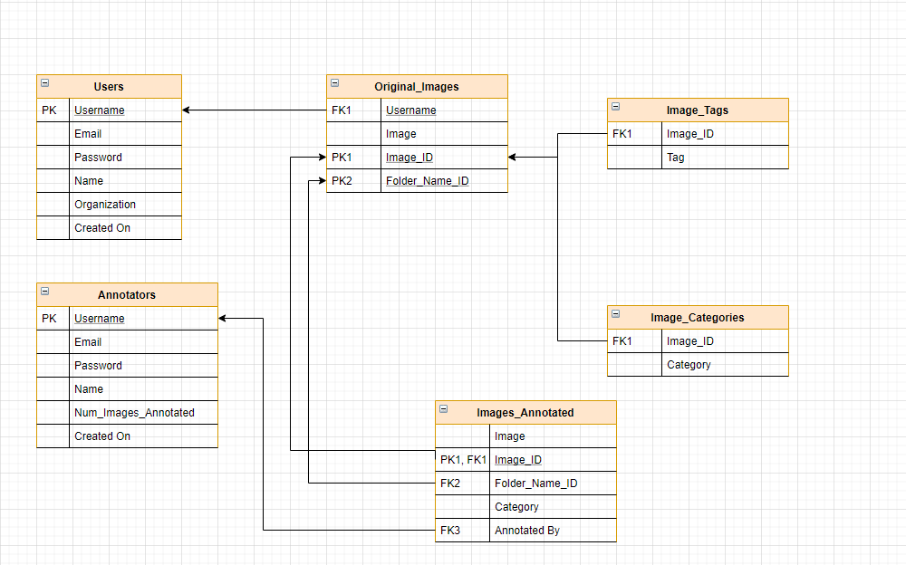

# Synopsis (_P4A16_)

This project aims to serve the most important prerequisite of predictive models in data science, i.e. **high quality training data**. We target the image recognition space, as it's the field of machine learning that is in most need of well labelled, true, precise and high quality training data.

## The Project

This project will comprise of all basic functionalities required to produce high quality labelled images required for training image recognition models.
- The end **user** will be able to _upload unlabelled images_ which he/she will require for training his model.
- The **annotator** will _annotate_ the image by drawing a box around the object to be detected and _classify_ the image by **category** supplied by the **user**. 
- The **user** will then be able to _fetch_ all of his training data that has been labelled by the annotator.
- And to confer to security standards, user and annotators will have **roles** (authorization) assigned to them and will have to be **authenticated** to restrict what resource each can access on the server.

## Team

1. Ajay Mittur (1BM18CS006)
2. Akshay Mittur (1BM18CS010)
3. Bhushith Gagan (1BM18CS024)

## Tech Stack

- Database - **MySQL**
- Server (REST API) - **Spring Boot (Java)**
- Cloud Storage - **AWS S3**
- Frontend - **React.js**

### Database Schema

### Database Entity-Relation Model

